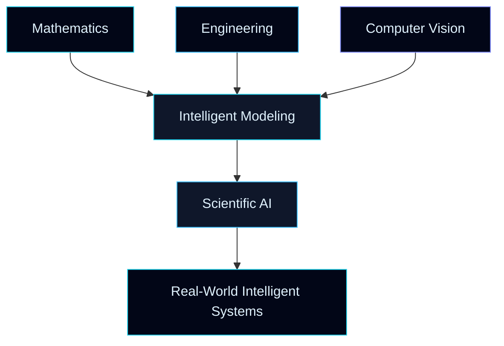

<div align="center">


</div>

<div align="center">

# Hi  I'm **Abbas Elahi**

### `Mechanical & Aerodynamics Engineer`
### `Mathematics Instructor`
### `Computer Vision Researcher`
### `Deep Learning Explorer`

<br>


</div>

---

<div align="center">


<br><br>


</div>

---

## 🧬 Identity Matrix

```txt
╔════════════════════════════════════════════════════════════════════╗
║                                                                    ║
║   NAME        : Abbas Elahi                                        ║
║   DOMAIN      : Engineering × Mathematics × Artificial Intelligence ║
║   CORE PATH   : Computer Vision & Deep Learning                    ║
║   BACKGROUND  : Mechanical & Aerodynamics Engineering              ║
║   MISSION     : Turning classical science into intelligent          ║
║                 computational systems                              ║
║                                                                    ║
╚════════════════════════════════════════════════════════════════════╝
```

---

## 🌌 About Me

I come from the world of **Mechanical & Aerodynamics Engineering**, where equations describe motion, forces, flow, and structure.

For years, I have taught **Mathematics** — the language behind every serious scientific model.

Now, I am exploring the frontier of **Deep Learning**, **Computer Vision**, and **Scientific AI**, where mathematical beauty becomes intelligent software.

My vision is to build a bridge between:

```txt
Classical Engineering  ──►  Mathematical Modeling  ──►  Deep Learning  ──►  Intelligent Systems
```

Where **Navier–Stokes equations meet neural networks**,  
and **pixels transform into insight**.

---

## 🚀 Mission Control

<table>
<tr>
<td width="50%">

### 🛰️ Current Learning Orbit

- Mathematical foundations of deep learning
- Neural network architectures
- Computer vision pipelines
- Optimization in AI models
- Scientific machine learning

</td>
<td width="50%">

### 🔭 Research Galaxy

- Computer Vision
- Deep Learning
- Mechanics-informed AI
- Aerodynamics + Machine Learning
- Image Processing
- Scientific Computing

</td>
</tr>
</table>

---

## 🧠 My AI Philosophy

<div align="center">



</div>

---

## ⚙️ Tech Arsenal

<div align="center">

### Core Languages & Scientific Stack


<br><br>

### AI / Deep Learning / Computer Vision


<br><br>

### Data, Backend & Systems


</div>

---

## 🧪 Research Lab

<div align="center">

| System | Description |
|-------|-------------|
| 🧮 **Mathematical Engine** | Linear Algebra, Calculus, Optimization, Probability |
| 🌊 **Engineering Core** | Fluid Mechanics, Aerodynamics, Classical Mechanics |
| 👁️ **Vision Module** | Image Processing, Feature Extraction, Object Understanding |
| 🧠 **Neural System** | Deep Learning, CNNs, Modern Architectures |
| ⚙️ **Scientific AI** | Physics-aware and engineering-inspired AI models |

</div>

---

## 🕶️ Dark Mode Skill Cards

<div align="center">


<br>


<br>


</div>

---

## 🧭 Navigation Map

```txt
                   ┌──────────────────────┐
                   │   MATHEMATICS CORE   │
                   └──────────┬───────────┘
                              │
                              ▼
┌──────────────────┐   ┌──────────────┐   ┌──────────────────┐
│   ENGINEERING    │──►│  SCIENTIFIC  │◄──│  COMPUTER VISION │
│    MECHANICS     │   │      AI      │   │   IMAGE SYSTEMS  │
└──────────────────┘   └──────┬───────┘   └──────────────────┘
                              │
                              ▼
                   ┌──────────────────────┐
                   │ INTELLIGENT SYSTEMS  │
                   └──────────────────────┘
```

---

## 📊 GitHub Analytics

<div align="center">


</div>

---

## 🔥 Neural Activity Streak

<div align="center">


</div>

---

## 🌌 Contribution Universe

<div align="center">


</div>

---

## 🏆 Achievement Terminal

<div align="center">


</div>

---

## 🧩 Collaboration Signal

```txt
I am open to collaborations where classical science meets modern AI:

[ Mechanics ] + [ Computer Vision ] + [ Deep Learning ] + [ Mathematical Modeling ]

Possible directions:
→ Vision-based engineering analysis
→ AI-assisted mechanics simulation
→ Scientific image understanding
→ Deep learning for physical systems
→ Educational AI tools for mathematics and engineering
```

---

## 🌐 Communication Portal

<div align="center">

<a href="https://github.com/Abbas-Elahi" target="_blank">
  
</a>

<a href="https://www.linkedin.com/in/aba-ehi-186698167" target="_blank">
  
</a>

<a href="mailto:abbaselahi@mail.ir">
  
</a>

</div>

---

## 🧠 Core Statement

<div align="center">

> **“Mathematics gives structure to thought, engineering gives purpose to design, and AI gives intelligence to systems.”**

</div>

---

<div align="center">

```txt
SYSTEM STATUS      : ONLINE
RESEARCH MODE      : ACTIVE
VISION ENGINE      : RUNNING
MATHEMATICS CORE   : STABLE
ENGINEERING LOGIC  : ENABLED
```

</div>

---

<div align="center">


</div>
